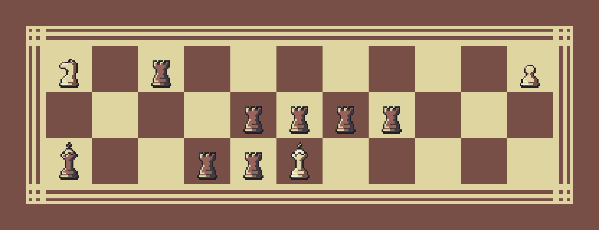
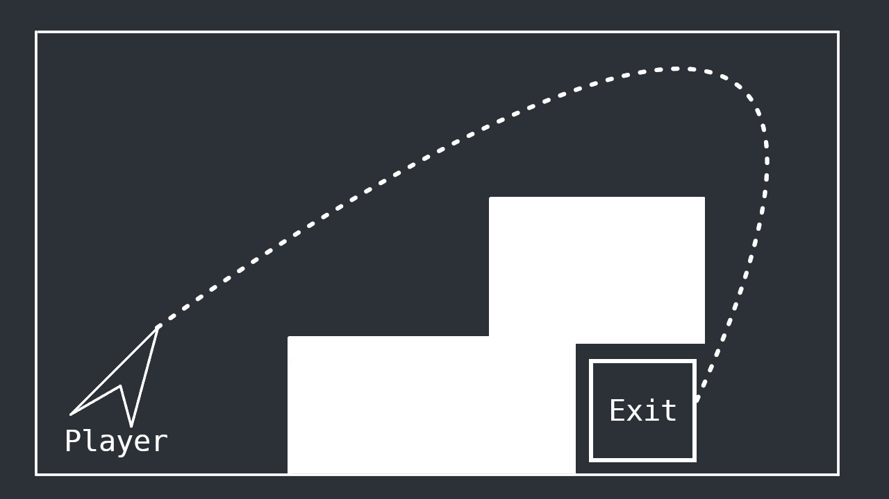
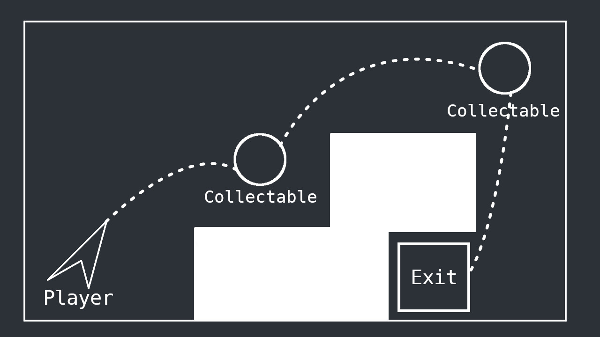
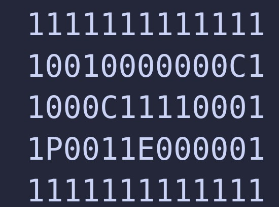
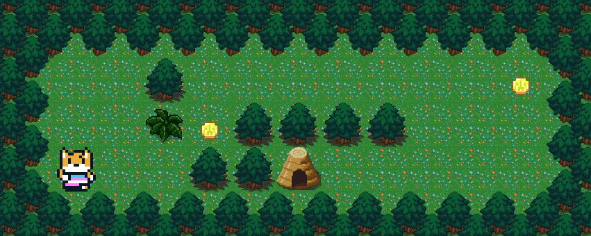
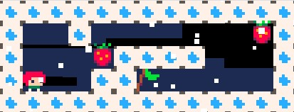

# so_long
<!-- vscode-markdown-toc -->
* [¡Bienvenido a tu primer videojuego!](#Bienvenidoatuprimervideojuego)
* [Uso e instrucciones](#Usoeinstrucciones)
* [Libería Minilibx](#LiberaMinilibx)
	* [Qué es y cómo instalarla](#Quesycmoinstalarla)
	* [Funciones y usos](#Funcionesyusos)
		* [Gestión de MLX y ventanas](#GestindeMLXyventanas)
		* [Texturas e imagenes](#Texturaseimagenes)
* [Bibliografía y recursos](#Bibliografayrecursos)
	* [Páginas web](#Pginasweb)
	* [Vídeos](#Vdeos)

<!-- vscode-markdown-toc-config
	numbering=false
	autoSave=true
	/vscode-markdown-toc-config -->
<!-- /vscode-markdown-toc -->

## <a name='Bienvenidoatuprimervideojuego'></a>¡Bienvenido a tu primer videojuego!



¡Hola! Este proyecto se llama so_long, y se trata de un primer acercamiento al mundo de los videjuegos a través del lenguaje de programación C. Aquí vas a aprender a manejar una librería externa, dibuhar pixeles en pantalla y como manejar el input del usuario para crear unos controles básicos.

Una de las partes más díficiles de un videojuego es pensar en el concepto del mismo, las mecanicas y qué experiencia vamos a ofrecer al usuario. Pero como este proyecto trata sobre aprender a programar (y no como conceptualizr un videojuego, para eso te recomiendo que le preguntes a [Mark Brown](https://www.youtube.com/channel/UCqJ-Xo29CKyLTjn6z2XwYAw)), vamos a partir de una idea sencilla y ver cómo la podemos programar en algo que parezca un videojuego.

Imáginate un mapa 2D sencillito, casi minimalista. Algo así como un boceto de lo que sería el nivel de un videojuego. Piensa en algo básico, como paredes que no puedes atravesar y una salida que alcanzar. 



Vale, esto es un poco soso. ¿Le podemos dar algo de gracia? Vamos a ponerle algo, como objetos que coleccionar para poder desbloquear la salida, por ejemplo.



Ok, esto ya está algo mejor. Vale, ¿y como representariamos esto con letras y números, para que lo pueda leer un ordenador?



¡Ok! Esto ya tiene pinta de mapa. Si le echamos imaginación, te puedes incluso imaginar la vista cenital de un Zelda/Tunic, como este proyecto de [Emmatosorus](https://github.com/Emmatosorus/so_long)...



... o incluso un plataformas en 2D, como está adaptación del Celeste de 8Pico de (Alienxbe)[https://github.com/Alienxbe/SoLong#].



Yo al verlo se me ha venido a la cabeza un mapa de ajedrez, y gracias a los assets Pixel Chess de (DANI MACCARI)[https://dani-maccari.itch.io/pixel-chess] le he podido dar forma a algo como esto.


¿No pinta mal, verdad? Hasta le podemos poner un nombre así con gancho... ¿Qué tal algo como King's Pawns? ¿Y si le hacemos una banda sonora así sencilla?

https://github.com/user-attachments/assets/a6b7a7d9-6f13-4c87-b816-1b32c84f99f4

Pues ahora que ya tenemos una idea de lo que va este proyecto, vamos a ver cómo podemos ir de la teoría a la práctica y cómo se puede programar un pequeño videojuego en C.

## <a name='Usoeinstrucciones'></a>Uso e instrucciones

Si quieres probar esta maravilla técnica, es tan sencillo como llamar al Makefile y cargar un mapa valido. El movimiento es con WASD.

```
git clone git@github.com:AlexGreenfield/so_long.git

cd so_long
```

Para una implementación básica

```
make && ./so_long <ruta del mapa>
```
Para una implementación más avanzada (animaciones, enemigos...)

```
make bonus && ./so_long_bonus <ruta del mapa>
```

## <a name='LiberaMinilibx'></a>Libería Minilibx

### <a name='Quesycmoinstalarla'></a>Qué es y cómo instalarla

Una de los puntos clave de este proyecto es aprender a usar librerías externas. En concreto, vamos a manejar una librería llamada [MinilibX](https://github.com/42Paris/minilibx-linux), una versión minimalista del sistema de ventanas [X](https://en.wikipedia.org/wiki/X_Window_System) de Linux.

Esta librería es la que nos va a permitir crear nuevas ventanas en nuestro escritorio, dibujar en ellas nuestros pixeles y manejar el input del usuario. Vamos, que se encarga de toda la parte visual de nuestro juego.

Ojo, porque hay dos versiones de la MinilibX que puedes utilizar, la [versión original de 42Paris](https://github.com/42Paris/minilibx-linux), o la [versión mejorada de Codam](https://github.com/codam-coding-college/MLX42) (el 42 de Países Bajos). Para este proyeco **recomiendo encarecidamente utilizar la de Codam**. En la librería de Codam es mucho más facil uitliar .png a la hora de construir texxturas y assets, mientras que en la versión estandar tendrás o que dibujar los assets a mano en .xpm, o convertirlos de .png a .xpm con herramientas externas. Además, creo que la documentación de Codam está ejor y es más accesible.

**Nota importante**: todo este repositorio y está basado en la librería de Codam, aunque dejo instrucciones para instalar ambas por si la quieres probar.

Lo primero de todo, aunque nosotros vamos a usar la minilibx, esta depende a su vez del sistema de ventanas X original. En concreto depende de `xorg`, `x11` y `zlib`, por lo que tenemos que instalar `xorg`, `libxext-dev` y `zlib1g-dev`.

```
sudo apt-get update && sudo apt-get install xorg libxext-dev zlib1g-dev libbsd-dev
```

Una vez que tenemos lo necesario, hay que meter la Minilibx dentro de la carpeta de nuestro proyecto (asumiendo de que ya hayas creado tu repo en Git). En lugar de un git clone dentro de nuestro proyecto (lo que nos va a dar conflicto con nuestro propio Git), lo mejor es hacer un [submodulo](https://git-scm.com/book/en/v2/Git-Tools-Submodules). Es decir, una referencia para que Git descargue los archivos del respositorio original en lugar de volver a subir nosotros los archivos a nuestro propio Github.

```
# MinilibX 42 París
git submodule add https://github.com/42Paris/minilibx-linux

# MLX42 Codam
git submodule add https://github.com/codam-coding-college/MLX42
```

Se creará una nueva carpeta, minilibx-linux o MLX42 dependiendo de la librería que hayas elegido. Metete dentro y ejecuta `configure` o `cmake` desde la terminal. 

```
# MinilibX 42 París
cd minilibx-linux
./configure

# MLX42 Codam
git clone https://github.com/codam-coding-college/MLX42.git
cd MLX42
cmake -B build # build here refers to the outputfolder.
cmake --build build -j4 # or do make -C build -j4
```

Una vez que hemos hecho make, acuerdate de meter los .h en el header de tu proyecto.

```c
// MinilibX 42 París
#include "minilibx-linux/mlx.h"
#include "minilibx-linux/mlx_int.h"

// MLX Codam
# include "MLX42/MLX42.h"
```

Por último, nos falta unir todas las librerías necesarias a la hora de compilar, tanto la Minilibx (que requiere como X11 y Xexti) como la MLX42.

Vamos a empezar con la Minilibx. Despues de hacer make en nuestra carpeta minilibx-linux, también se crearán dos archivos .a: libmlx.a y libmlx_Linux.a. Los vamos a necesitar para nuestro proyecto, así que a la hora de compilar tenemos que utilizar dos flags:

* **-L minilibx-linux/**: La flag -L le dice al compilador que busque dentro de la carpeta minilibx-linux.

* **-lmlx**: Una vez dentro de la carpeta minilibx-linux, le decimos que busque la libería libmlx.a (-lmlx).

Ahora que ya le hemos dicho al sistema donde tiene que buscar el .a de la Minilibx, nos queda señalarle que busque X11 y Xext. Al ser liberías instaladas en el propio sistema, basta con usar `-lXext` y `-lX11` para que las busque en nuestros binarios. El código se quedaría así.

```
cc main.c -L minilibx-linux/ -lmlx -lXext -lX11
```

Como vamos a tener que usar estas flags por cada objeto, lo mejor es incluir esta regla en el Makefile.

```
$(NAME): $(OBJ)
	cc $(OBJ) -o $(NAME) -L minilibx-linux/ -lmlx -lXext -lX11
```
Para la MLX42, aparte del archivo `libmlx42.a` necesitamos instalar y cargar la librería [`GLWF`](https://www.glfw.org/), basada en OpenGL. Tienes [instrucciones](https://github.com/codam-coding-college/MLX42#download-and-build---mlx42) de como hacerlo en la documentación de Codam. También puedes crear una regla en tu Makefile que aglutine todo cuando montes el programa:

```
# Compiling libs and flags
LIBS	:= $(LIBMLX)/build/libmlx42.a -ldl -lglfw (puedes añadir más liberías)
```

### <a name='Funcionesyusos'></a>Funciones y usos

A partir de aquí me voy a centrar en el uso básico de la MLX42 de Codam, aunque lo mejor es que te leas la [documentación](https://github.com/codam-coding-college/MLX42/wiki) y el [MLX42.h](https://github.com/codam-coding-college/MLX42/blob/master/include/MLX42/MLX42.h) para conocer todas las funciones que hay. La documentación de la Minillibx de 42 París es muy pobre, asi que si tienes alguna duda te recomiendo que leas esta [guía](https://harm-smits.github.io/42docs/libs/minilibx).

#### <a name='GestindeMLXyventanas'></a>Gestión de MLX y ventanas

La mayoría de la MLX42 gira alrededor de la estructura `mlx`, que alberga toda la información relevante de nuestra ventana. Así que sería buena idea que te fueras familiarizando con ella.

```c
 * Main MLX handle, carries important data in regards to the program.
 * @param window The window itself.
 * @param context Abstracted opengl data.
 * @param width The width of the window.
 * @param height The height of the window.
 * @param delta_time The time difference between the previous frame 
 * and the current frame.
 */
typedef struct mlx
{
	void*		window;
	void*		context;
	int32_t		width;
	int32_t		height;
	double		delta_time;
}
```

##### <a name='mlx_init'></a>mlx_init

Inicia una estructura que va a alojar el resto de información sobre nuestro sistema de ventanas. Es el puntero principal que dicta el resto de elementos de nuestro sistema, como las diferentes ventanas que vamos a usar.

```c
	mlx_t	*mlx;

	mlx = mlx_init(1920,1080, "Your new window", false);
```

##### <a name='mlx_terminate'></a>mlx_terminate

Una vez que has inicializado una estructura `mlx`, tienes que liberarla con `mlx_terminate` para evitar leaks.

```c
	mlx_t	*mlx;

	mlx = mlx_init(1920,1080, "Your new window", false);
	mlx_terminate(mlx);
```

##### <a name='mlx_close_window'></a>mlx_close_window

También puede que quieras cerrar la ventana que has creado, pero no destruir la estructura (por ejemplo, para cerrar la ventana al pulsar ESC). Para ello puedes usar `mlx_close_window`.

```c
	mlx_t	*mlx;

	mlx = mlx_init(1920,1080, "Your new window", false);
	mlx_close_window(mlx);
	mlx_terminate(mlx);
```

##### <a name='mlx_set_setting'></a>mlx_set_setting

Antes de iniciar una estructura `mlx`, puedes elegir que características va a tener la ventana, como por ejemplo que se inicie a pantalla completa o que no se muestre directamente. Útil para modificar el comportamiento de la ventana.

```c
typedef enum mlx_settings
{
	MLX_STRETCH_IMAGE = 0,	// Should images resize with the window as it's being resized or not. Default: false
	MLX_FULLSCREEN,			// Should the window be in Fullscreen, note it will fullscreen at the given resolution. Default: false
	MLX_MAXIMIZED,			// Start the window in a maximized state, overwrites the fullscreen state if this is true. Default: false
	MLX_DECORATED,			// Have the window be decorated with a window bar. Default: true
	MLX_HEADLESS,			// Run in headless mode, no window is created. (NOTE: Still requires some form of window manager such as xvfb)
	MLX_SETTINGS_MAX,		// Setting count.
}	mlx_settings_t;

mlx_t	*mlx;

mlx_set_setting(MLX_HEADLESS, true);
mlx = mlx_init(1920,1080, "Your new window", false);
mlx_terminate(mlx);
```

##### <a name='mlx_get_window'></a>mlx_get_window

También es útil obtener información sobre que monitor está usando el usuario, sobre todo para saber qué resolución está utilizando. Para ello podemos usar `mlx_get_window`, que alamcena esta información en dos punteros a `int32_t`.

```c
mlx_t	*mlx;
int32_t	width;
int32_t	height;

mlx = mlx_init(1920,1080, "Your new window", false);
mlx_get_monitor_size(0, &width, &height);
mlx_terminate(mlx);
```

##### <a name='LoopsyHooks'></a>Loops y Hooks
Si ya has probado a inicializar una ventana, puede que te estés preguntando por qué no se te muestra nada en pantalla al ejecutar tu programa. Si no le indicas a tu programa que se detengba a mostrar esta pantalla, la ejecución va a continuar su camino y el programa terminará de ejecutarse antes de mostrar nada al usuario.

Para ello, tienes que hacer uso de los `loops`, funciones que mantienen el programa abierto y evitan que se acabe la ejecución antes de tiempo.

##### <a name='mlx_loop'></a>mlx_loop

Es el encargado de mantener nuestro proceso en abierto. Sin el la ventana automáticamente se cerraría y se acabaría el proceso.

```c
	mlx_t	*mlx;

	mlx = mlx_init(1920,1080, "Your new window", false);
	mlx_loop(mlx);
	mlx_terminate(mlx);
```

##### <a name='mlx_hook'></a>mlx_hook
Si llamamos a una función `loop`, nuestro programa se va a quedar ejecutando hasta el infinito a no ser que le digamos que pare. Para ello están las funciones `hook`, funciones que recogen el input del usuario y realizan una determinada acción. Por ejemplo, cerrar una ventana si pulsamos ESC a través de la función `mlx_key_hook`.

```c
void	close_mlx(mlx_key_data_t keydata, void *param)
{
	mlx_t	*mlx;

	mlx = (mlx_t *)param;
	if (keydata.key == MLX_KEY_ESCAPE && keydata.action == MLX_PRESS)
		mlx_close_window(mlx);
}

int	main(void)
{
	mlx_t	*mlx;

	mlx = mlx_init(1920,1080, "Your new window", false);
	mlx_key_hook(mlx, close_mlx, mlx);
	mlx_loop(mlx);
	mlx_terminate(mlx);
	return (0);
}
```

Hay diferentes tipos de `hooks` dependiendo de la acción que quieres hacer, así que lo mejor es que repases el manual y decidas que es lo que más se ajusta a lo que quieras hacer.

#### <a name='Texturaseimagenes'></a>Texturas e imagenes

Ahora que ya sabemos iniciar una ventana y que se muestre por pantalla, toca llenarla de vida. Aquí es donde la MLX42 de Codam brilla, ya que podemos cargar .png directamente a nuestra ventana de forma simple.

##### <a name='mlx_load_png'></a>mlx_load_png
El primer paso es cargar nuestro .png en el programa. Para ello podemos usar la función `mlx_load_png`, que toma como argumento la ruta de la imagen que queremos cargar y la convierte a una textura que podemos utilizar bajo la estructura `mlx_texture`. También debemos eliminar esa textura con `mlx_delete_texture`.


```c
	mlx_texture_t	*b_king_t;

	b_king_t = mlx_load_png("./textures/pieces/b_king_32.png");
	mlx_delete_texture(b_king_t);
```

##### <a name='mlx_texture_to_image'></a>mlx_texture_to_image
Una vez que tengamos nuestra textura, tenemos que cargarla en una imagen bajo la estructura `mlx_image_t` a través de la función `mlx_texture_to_image`, que recibe como argumento nuestra instancia de `xml` y la textura que queremos cargar. También tendremos que liberar esa imagen con `mlx_delete_image`.

```c
	mlx_t	*mlx;
	mlx_texture_t	*b_king_t;
	mlx_image_t		*b_king_i;

	mlx = mlx_init(1920,1080, "Your new window", false);
	b_king_t = mlx_load_png("./textures/pieces/b_king_32.png");
	b_king_i = mlx_texture_to_image(mlx, texture);
	mlx_delete_image(b_king_i);
	mlx_delete_texture(b_king_t);
	mlx_terminate(mlx);
```

##### <a name='mlx_image_to_window'></a>mlx_image_to_window
Por último, sólo queda mostar la imagen por pantalla. Para eollo utiliza `mlx_image_to_window`, que toma como argumento la instancia de `mlx`, la imagen que quieras renderizar, y las coordenadas dentro de la ventana.

```c
	mlx_t	*mlx;
	mlx_texture_t	*b_king_t;
	mlx_image_t		*b_king_i;

	mlx = mlx_init(1920,1080, "Your new window", false);
	b_king_t = mlx_load_png("./textures/pieces/b_king_32.png");
	b_king_i = mlx_texture_to_image(mlx, texture);
	mlx_image_to_window(mlx, b_king_i, 0, 0);
	mlx_loop(mlx);
	mlx_delete_image(b_king_i);
	mlx_delete_texture(b_king_t);
	mlx_terminate(mlx);
```

Con esto termina el repaso a las funciones básicas de la MLX42 de Codam. Te animo a que revises la documentación y te empapes de conocimiento. Hay muchas cosas interesantes, y a nada que cojas práctica ya vas a ir cogiendo una idea de lo que puedes hacer con esta librería.

## <a name='Bibliografayrecursos'></a>Bibliografía y recursos

### <a name='Pginasweb'></a>Páginas web

- [MiniLibx | 42 Docs](https://harm-smits.github.io/42docs/libs/minilibx)
- [MLX42 | Welcome to the MLX42 documentation](https://github.com/codam-coding-college/MLX42/wiki)

### <a name='Vdeos'></a>Vídeos

- [Beginner's Guide To The Desktop](https://www.youtube.com/playlist?list=PLTXMX1FE5Hj7JmR73CQDXkNq8OVn9_Z6F)
- [Draw a Pollock painting with the minilibX](https://www.youtube.com/watch?v=9eAPbNUQD1Y)
- [Introduction to the minilibX : a simple X-Window programming API in C](https://www.youtube.com/watch?v=bYS93r6U0zg)
